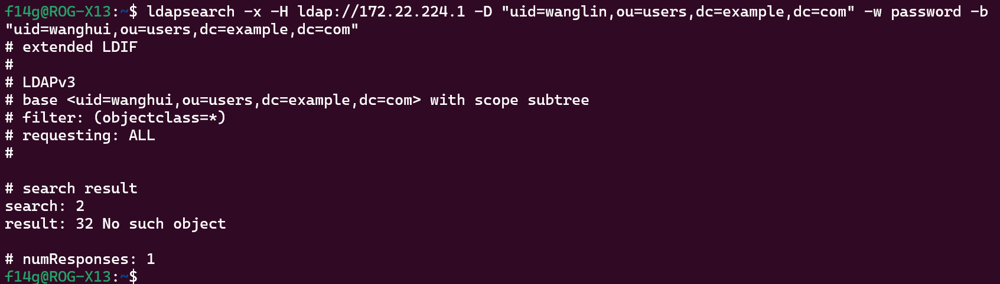

# ldap配置问题

docker环境地址：https://github.com/excuses0217/ldap-setup-range

1. dockerfile写ENTRYPOINT的话启动时会报错，必须手动进环境执行以下脚本

   比如下面这么写就不行

   

   这个./container/service/slapd/assets/test/bootstrap.sh脚本要进环境手动执行

   

2. /container/service/slapd/assets/test/bootstrap.sh这个脚本是用来添加用户和授予权限的，这里我设置了两个组manage和hr，manage组应该具有读写权限，hr组应该具有读权限，相关授权代码如下

   

   但是实际上好像没权限

   比如manage组下的用户wanglin

   

   

   可以查到自己

   

   但是查不了别人

   

   

   也不知道是不是我语法有问题

   当我使用可视化工具

   

   这是用admin账户登录

   

   可以看到还是没问题的

   但是使用wanglin账户还是登录不了
   

   所以想问一下授权这一步是哪有了问题

3. 这里想问一下上面这样为啥查不到，基选择了 "ou=users,dc=example,dc=com"，过滤条件"uid=qihoo"我觉得好像没问题
